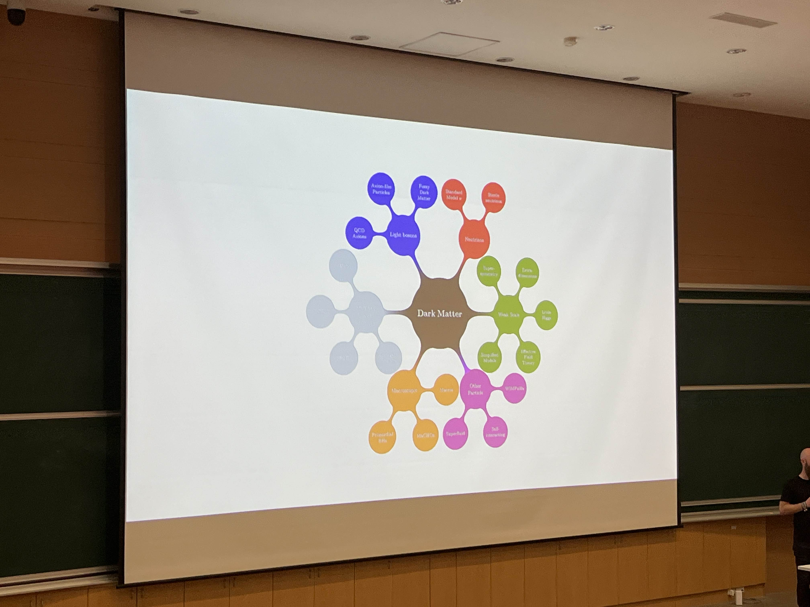
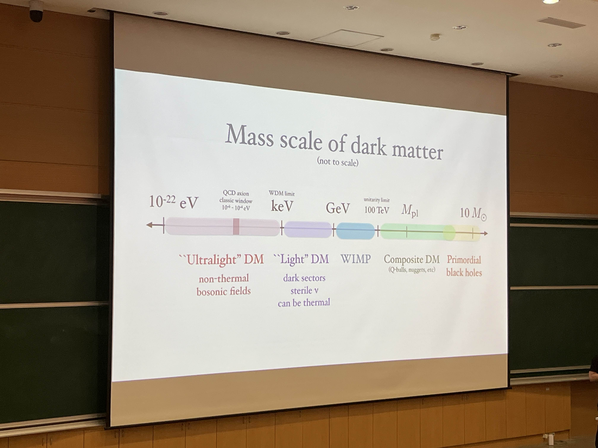
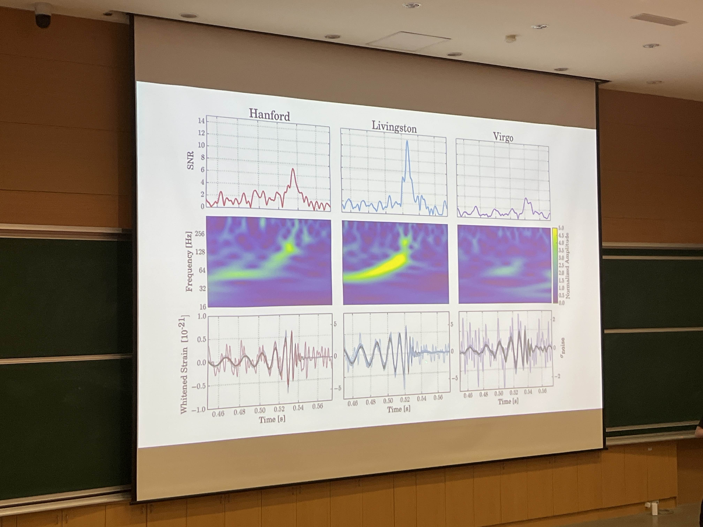
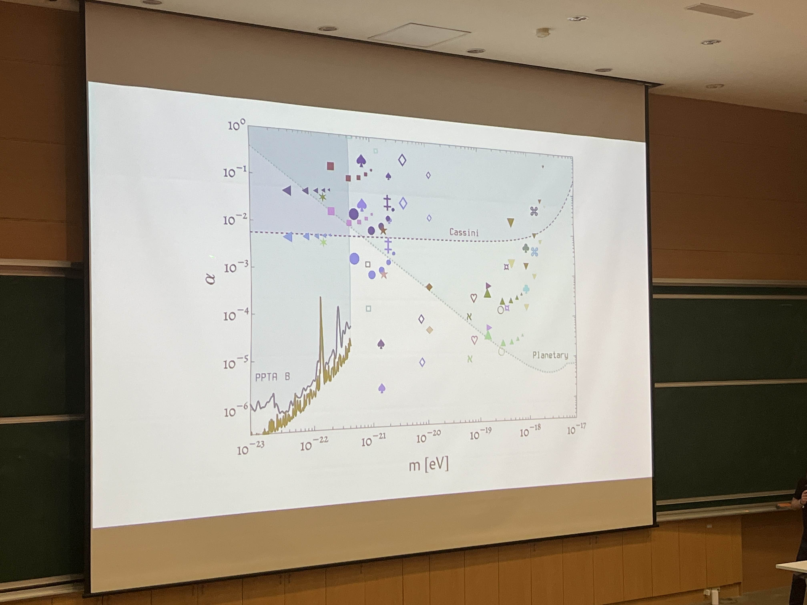

# NCKU speech

2024.11.15

84%?

*補充

暗物質在宇宙中物質的比例，只有 16% 是元素(週期表上的)

## 星系自轉速度

有一張圖，x軸是光年，y軸是速度。

*補充

目前少數可以間接看到暗物質的證據。

內部可以透過光譜紅移看到速度，外部觀測結果來自21公分譜線(氫原子譜線，波長是21公分，幾乎是微波)。

下面的是理論預測線。

## 宇宙背景輻射

然後是宇宙背景輻射的照片。

表示溫度?

*補充

這邊主要在說它的波動，透過傅立葉分析可以得到下兩張圖

## 奇妙的圖

好像聽到傅立葉方程

## 奇妙的表格

第三張(左下)好像很重要

*補充

他把宇宙微波背景輻射進行傅立葉變換，四個表分別是透過不同的參數去進行傅立葉變換，最大的波就是主要的特徵。

## 很多星系的圖

可能有說到什麼紅藍移之類的東西?

好像有什麼被扭曲了，有很大的質量?

有什麼東西是看不到的?

*補充

這裡在講微重力透鏡扭曲，他想用這個東西佐證自己的理論。

有被拉長的星系?

*補充

這個也是扭曲，在可見光上。

## 神奇的心智圖

中間寫的是暗物質，其他就不知道:D

暗物質的質量分類?

*補充

解釋什麼是 Ultra Light，也就是特別輕的暗物質，他的研究就在研究他。

## 酷炫的圖

用神奇的方法把星星連線了:O

但好像有副作用? 不知道:D

*補充

這是星系的絲狀結構，如果星系連成星系團的話就會變成這個樣子。

紫色圖亮亮的就是暗物質，在星系旁邊會有很多。

算是他核心的研究，這是他用現在主流的模型和現在的模型作的模擬，上面是主流的，中間不重要，下面是他的，他說他的模型可以解釋右邊那張圖的干涉?

連線是形成絲狀結構，副作用則是中間的空洞。

## Ultra Light

不知道在說啥，參數的樣子。

## 重力波

如果有質量的話就會有波，然後就可以觀察?

很漂亮，可以當桌布的樣子

*補充

這是三個不同機構的觀測結果，上面的是訊噪比，中間是頻譜圖，下面是時間對應的波型(重力波)

三個沒有完全對上，有一點點誤差。

數據? 窩不知道。

*補充

黑洞合成前和合成後的質量變化

加速了，逐漸要跟丟了 T_T

## dark metter waves

什麼東西?

想睡了.w.

什麼低於什麼就看不到之類的，然後什麼比什麼更有 powerful?

*補充

在說耦合強度，說能量怎麼在暗物質與物質間傳遞

什麼東西很敏感之類的。

*補充

在說一些觀測方法適用的觀測範圍

*補充

脈衝星計時法，透過波動可以看出他理論中的暗物質可以觀測(就他可以影響一些波這樣)

(教授很愛出：Perturbation 微擾)
(另一個很愛出：Fluctuation 波動)

用手比了個轉圈圈的手勢，但聽起來沒有提到轉圈圈:D

現在得不停打字，不然要睡著了。

*補充

紅色是適合他的 Ultra Dark metter 的脈衝星

什麼 there, or there, or there 之類的東西。

*補充

用脈衝星計時法可以確定一個星的絕對位置

*補充

左上可能是暗物質的影響，右上則是脈衝星角度對觀測的影響，左下描述的是重力波的投影，右下和右上應該一樣(或是不同模型)

很多漂亮的圖標ㄟ(<-精神狀態堪憂)

*補充

橫軸是質量，縱軸是耦合強度，這張圖在描述的是不同區間看到的物質範圍，而他的東西在現在我們還看不到的範圍中(或是需要很高精度)，所以還沒有東西證實他的理論。

總結? conclution 是總結對吧?

阿對結束ㄌ好欸:D

## 提問環節

even 什麼 dark matter 什麼 same 什麼 seem way 然後 no reson?

然後就跳到一個公式開始講解了?

好像是在吵某個東西沒辦法同時是兩個東西，然後直接就i don't understand 什麼東西, because your data(超台式英文) 什麼東西

演講者的手開始轉圈了? 耶:D

什麼 frequency is so frequency，然後教授就 OK 了?

下一個問題，跳到了一張圖，然後就 thankyou。

*補充

問題：如果一個波是 density wave(密度波)，他就不會是 coherent wave(干涉波)

回答：它可以同時是，舉了一些例子。

**下一題**

什麼 ㄌㄢㄉㄚ dark matter，conclud 什麼 sould be cold。

回答是什麼 very small, has do be grave them?

然後跳到那張星星變成一條線的圖，又跳到有漂亮圖標的圖。

*補充

ㄌㄢㄉㄚ = $\ \land$

應該是 $\ \land$ cold dark matter(冷暗物質理論，$\ \land$CDM)

問題：$\ \land$CDM 理論說暗物質應該要是冷的，但與你的不同。

回答：冷和輕不衝突，或許到了不同的觀測區間會有收穫

**下一題**

問題聽不懂，不像英文。

什麼什麼什麼，so  they heve to be stack(手做了上下搖擺的動作)。

**下一題**

什麼什麼什麼，is yes or not。

yes... (被打斷)

so (講了一大堆，聽起來像是在說什麼以前的研究...)

開始解釋...

so do you know (講一大堆，講到一半開始笑)，because it is new thing for me.

is ok.

*補充

問題：$\ \land$CDM 就是在說暗物質不會和重力以外的東西有交互作用，但是你提出的是會與別的有交互作用，沒錯嗎?

回答：對

問題：這跟我以前聽的不一樣

**下一題**

I not a 天文人, so i want ask a simple quetion，(重力波是什麼)

講解...

哦~

**下一題**

什麼 colorful pictur 之類的

跳到了把星星變成一條線的圖，好像是什麼變小之類的。

*補充

問題：有沒有什麼觀測證據嗎

回答：有，(但沒聽到)

**下一題**

because 什麼 cos is so sin, do you know any.. i am just curious.

到了宇宙背景輻射的那張圖，然後又到很多星系的圖。